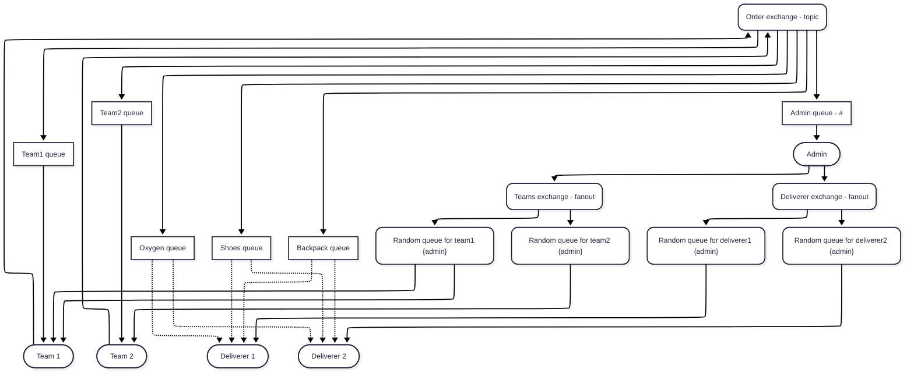

# Simple RabbitMQ Elixir Application to communicate teams and their deliverers

### Function to use with `iex -S mix`

- `{:ok, pid1} = Deliverer.start_link({:deliver1, ["oxygen", "shoes"]})`
- `{:ok, pid2} = Deliverer.start_link({:deliver2, ["oxygen", "backpack"]})`
- `{:ok, pid1} = Team.start_link({:team1})`
- `{:ok, pid2} = Team.start_link({:team2})`
- `Team.send_message("oxygen", :team1)`
- `Team.send_message("oxygen", :team2)`
- `Team.send_message("shoes", :team1)`
- `Team.send_message("shoes", :team2)`
- `Team.send_message("backpack", :team1)`
- `Team.send_message("backpack", :team2)`
- `{:ok, pid1} = Admin.start_link({:admin1})`
- `{:ok, pid2} = Admin.start_link({:admin2})`
- `GenServer.stop(pid1)`
- `GenServer.stop(pid2)`

## Installation

- `mix deps.get`
- `mix deps.compile`

## Diagram

